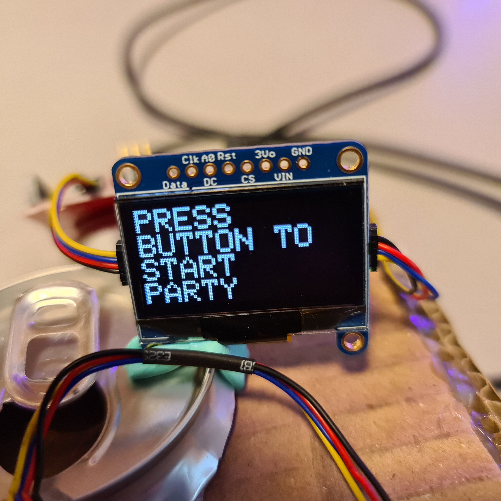
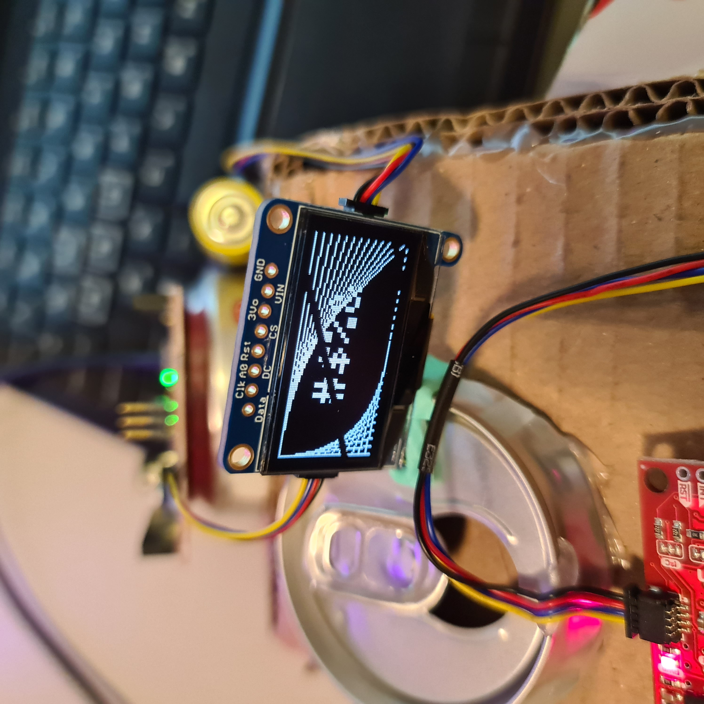
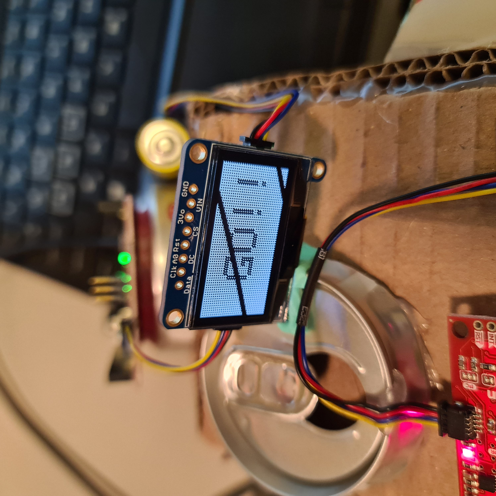
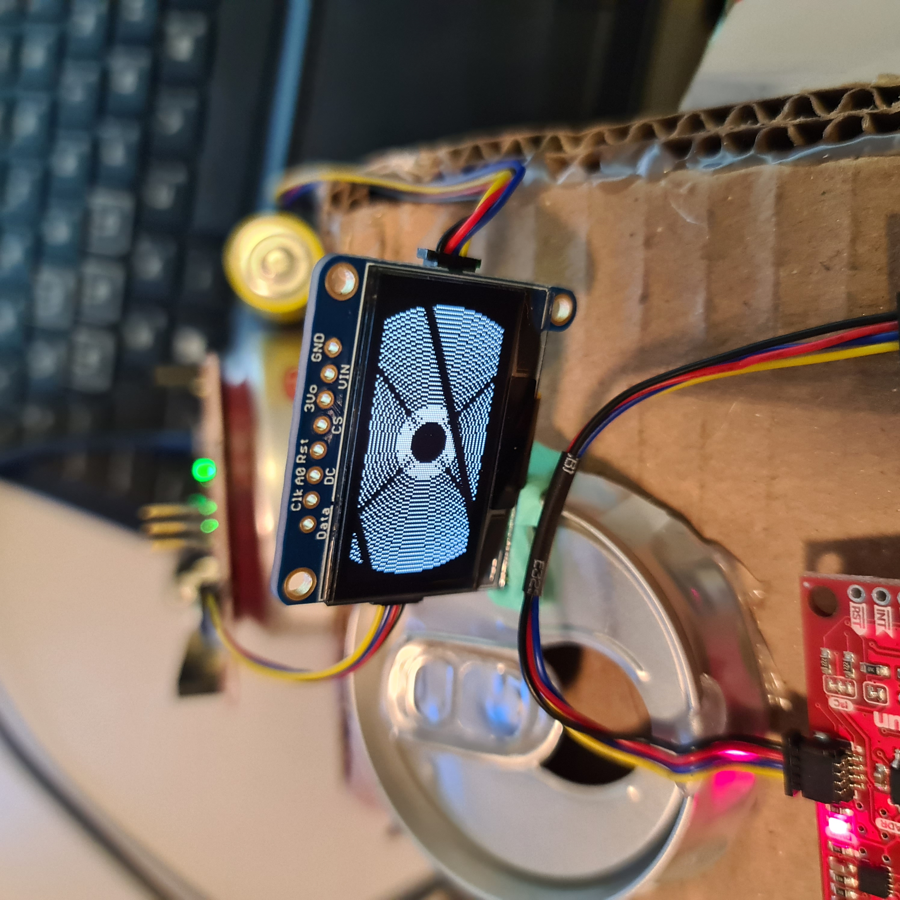
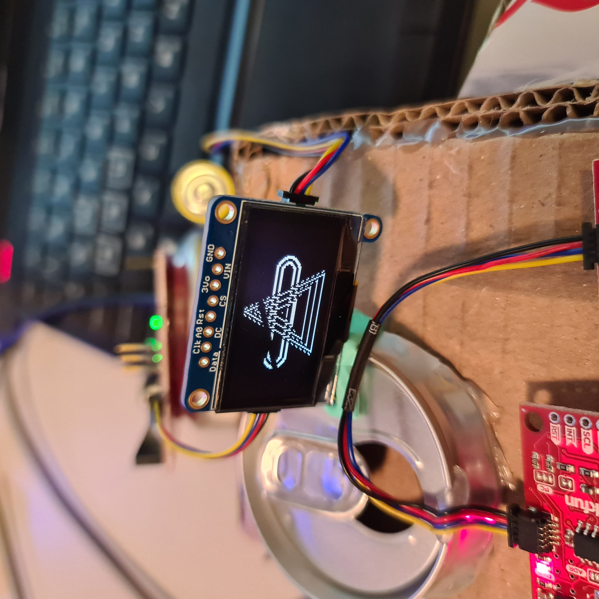

### Production Assignment: PARTY TANK

##### Discription

The robot will the tank made eariler in the class. the robot has two DC motors that are connected to wheels that are in turn powered by a battery. The robot also has a speaker this is powered by the red board and plays music throught the SD card. The Redboard is powered via battery that will allow it to run fully disconnected form the laptop. The robot has a button that when pressed will allow it to move in a set patteren before stopping and will start moving the button is pressed again. The robot also has a OLED that displays visuals similar to party visual effects. The robot will move forward, spin clockwise, then spin counter clockwise, then do a little dance, then spin again and do a little dance again.

##### OLED Visuals 

##### Video

There is a video in the files that will show the performence

##### Problems 

The Speaker at one point didnt play anything. deleting and reuploding the music file to the SD fixed the problem
