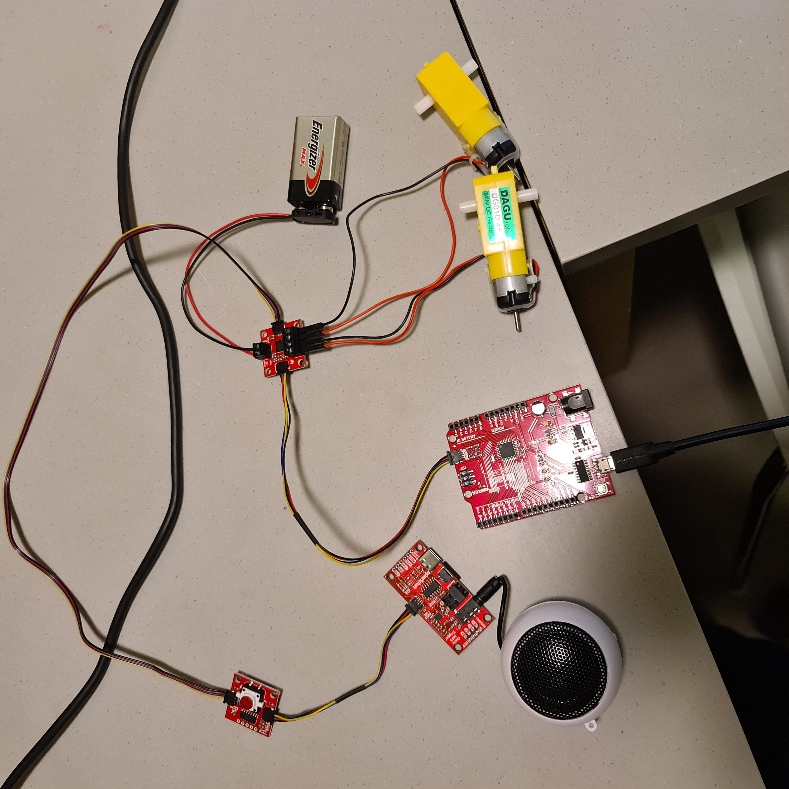
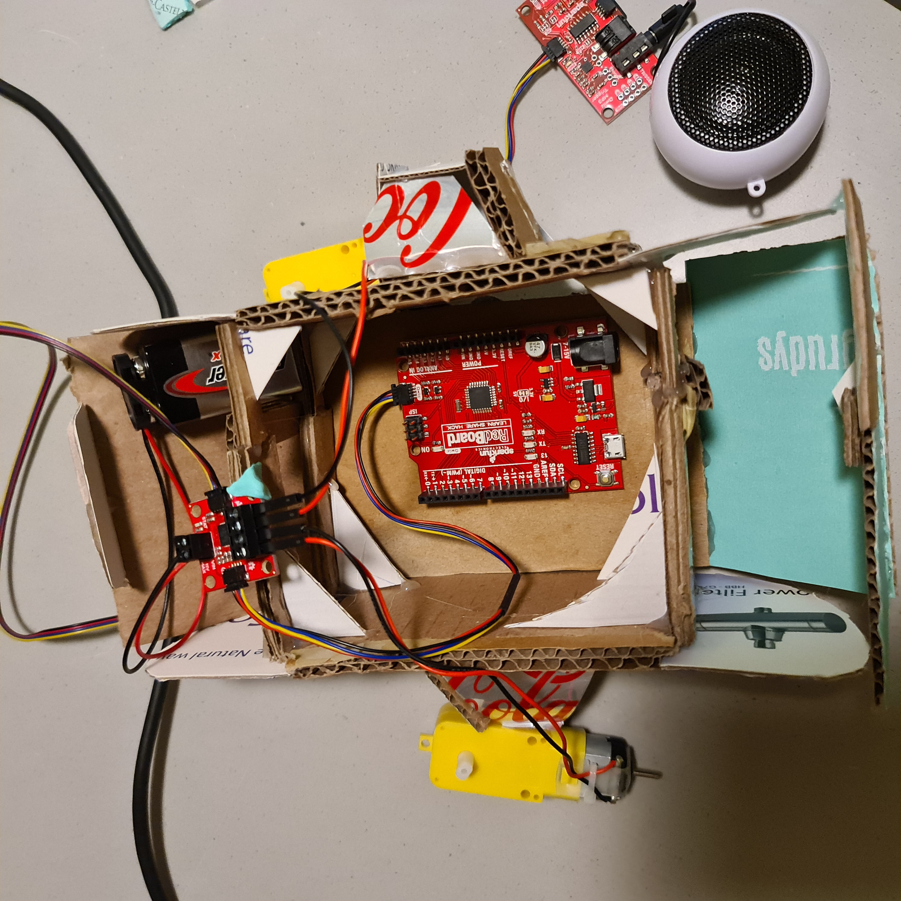
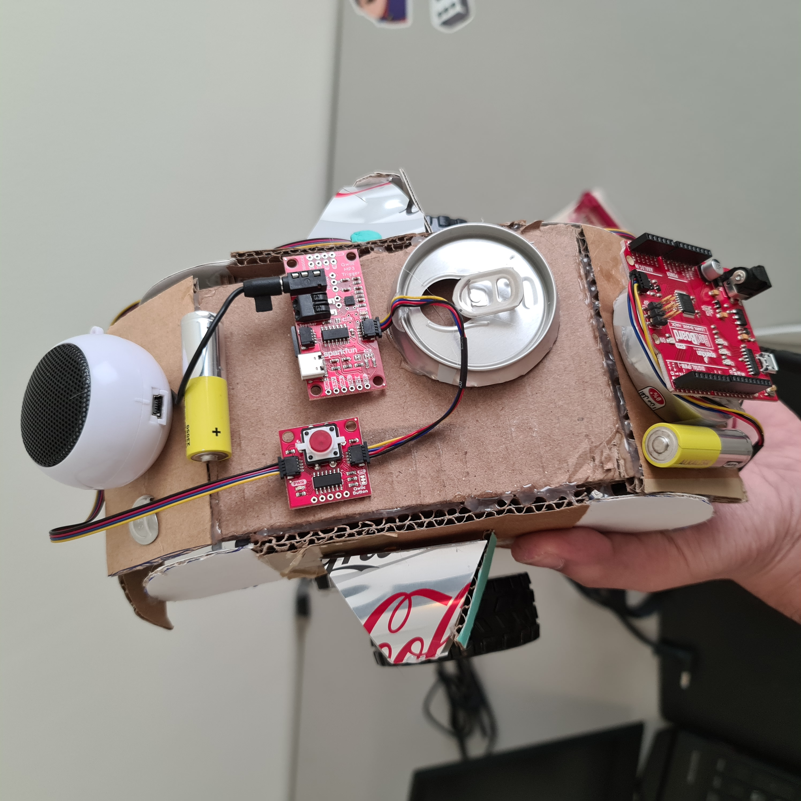
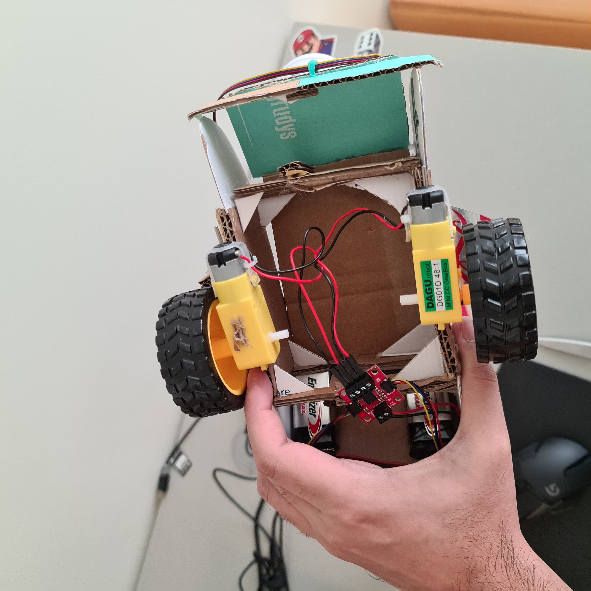

### Production Assignment: Performing Robot

#### Concept

The robot will the tank made eariler in the class. the robot has two DC motors that are connected to wheels that are in turn powered by a battery. The robot also has a speaker this is powered by the red board and plays music throught the SD card. The Redboard is powered via battery that will allow it to run fully disconnected form the laptop. The robot has a button that when pressed will allow it to move in a set patteren before stopping and will start moving the button is pressed again. The robot will move forward, right, left and forward when ever the button is pressed 

#### Circuit 

Redboard is attached to the Qwiic motor. Which is connected to the DC motors, the battries and The Qwiic button. the Qwiic button is connected to the speaker Qwiic that has the SD card which is in the end connected to the Hamburger

#### Intended Assembly

#### Connections on the Tank

#### Video

There is a file in the folder that will show the final working result Final.mp4

#### Problems 

1. Structural falliures. lots of them 
2. Glue between a metal object and a circuit board does not bind that well. go a bit overboard
3. Remember to check the orientation of the motors before glueing 

#### Notes

1. Super glue is nice alternative to the glue gun for tricky spots
