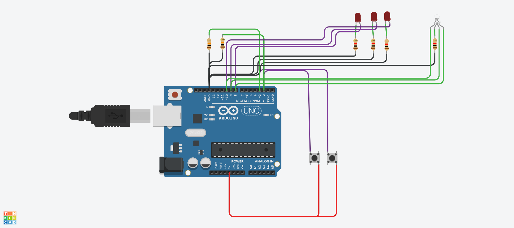

## Production Assigment 

The circuit has 2 buttons 3 LEDs and 1 RGB LED. Whenever one of the buttons is pressed the corrospoing 3 LEDs turn off and on in a certain way. Whenever a LED is turned on a corrosponding color on the RGB LED is also turned on

#### Schematic 

#### Tinkercad Circuit

The two buttons are coneected to the 5V power pin from one side while also being grounded by a 10K Ohm resistor and connected to digital pins 2 and 3

The LEDs are connected to 1K Ohm resistors and which are then grounded. The LEDs are also connected to Digital pins 8,9,10

The RGB LED similar to the LEDs is also connected to a 1K Ohm resistor which is grounded. each of the RGB pins of the RGB LED is also connected to pins 8,9,10

#### notes

sometimes the wires dont get connected to the pins. make sure the pin has a red box over it when connected the wires.
