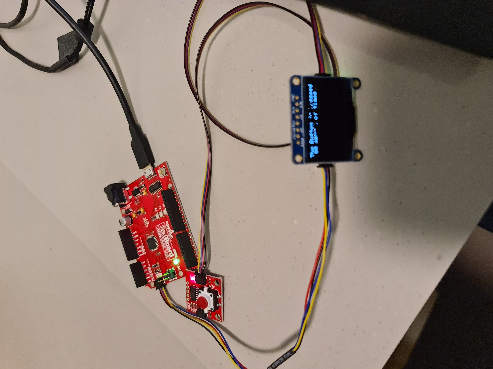
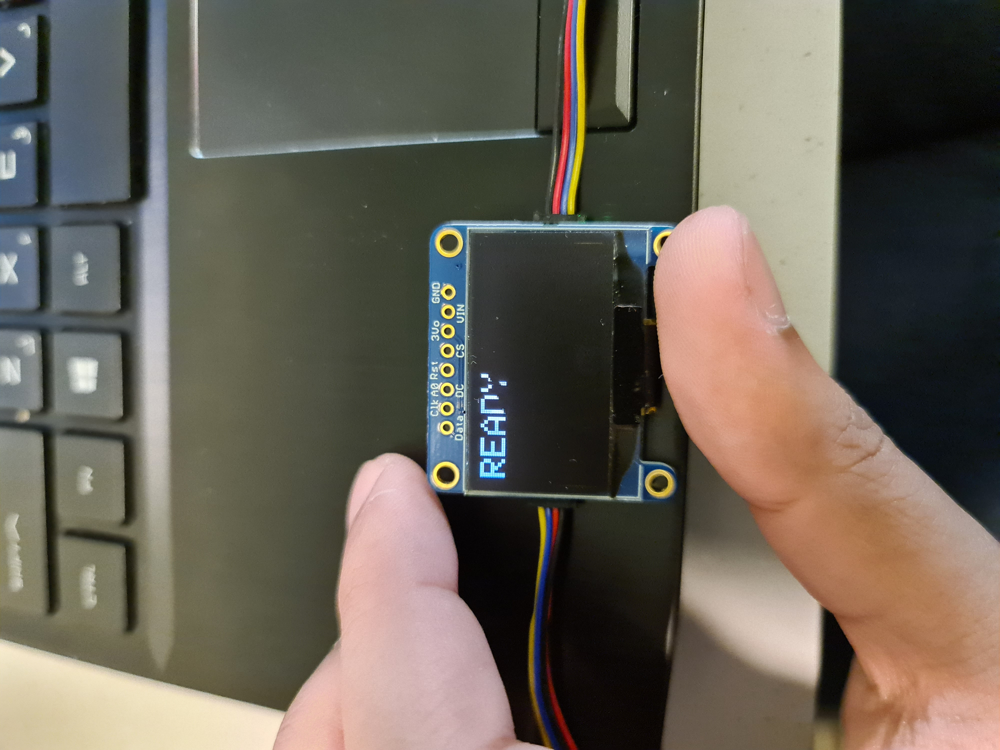
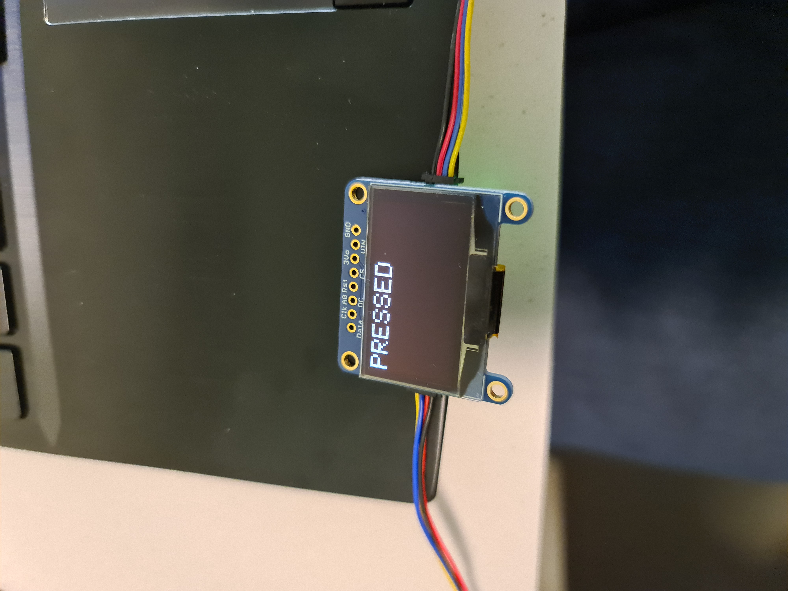
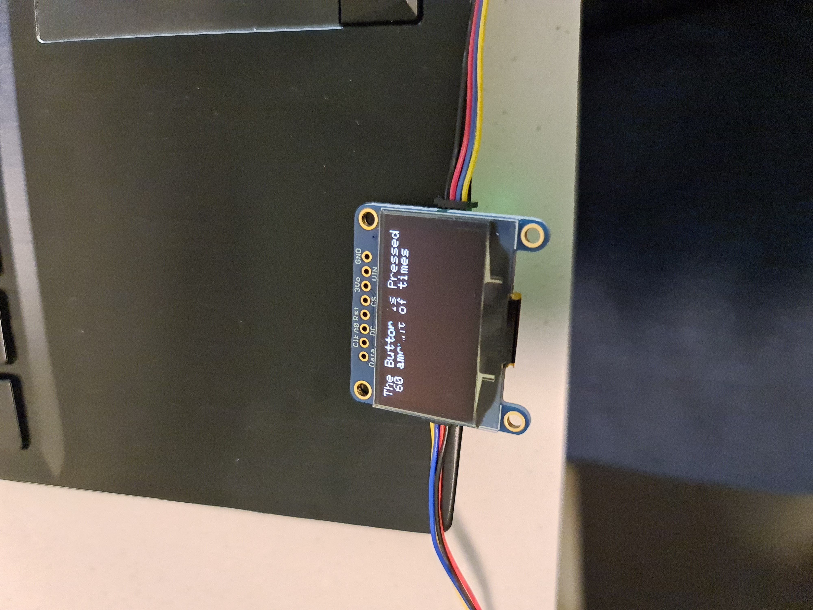

### OLED Production Assignment 

This program uses the Qwiic OLED screen and Qwiic Button. The program will check is both of the devices are connected to the redboard and if one of the devices is missing it will run a infinite loop while giving a missing device message if all the devices are ready it will give a ready message for each device and will display the text ready on the OLED if the user presses the button the OLED will change the text to is 'pressed' after the user lets go of the button the OLED will display a sentence telling the number of times the button is pressed/detected in the period of time pressing the button again the OLED will again display the Pressed text and again letting go of the button will tell how many times it is pressed

The setup on the redboard

When all the checks are passed READY is displayed on the OLED

When the button is pressed the OLED displays PRESSED

After the button is pressed the OLED shows how many times the button press was detected

##### Problems

 
sometimes when the function is not called properly or when the .display is missing or when there is nothing to loop to next the OLED will display the last known graphic or will display the random pixels

#### Note

Special thanks to Baraa for letting me use his OLED screen before I could get my replacement. would not have had time to finish the assignment on sunday without his prior help
