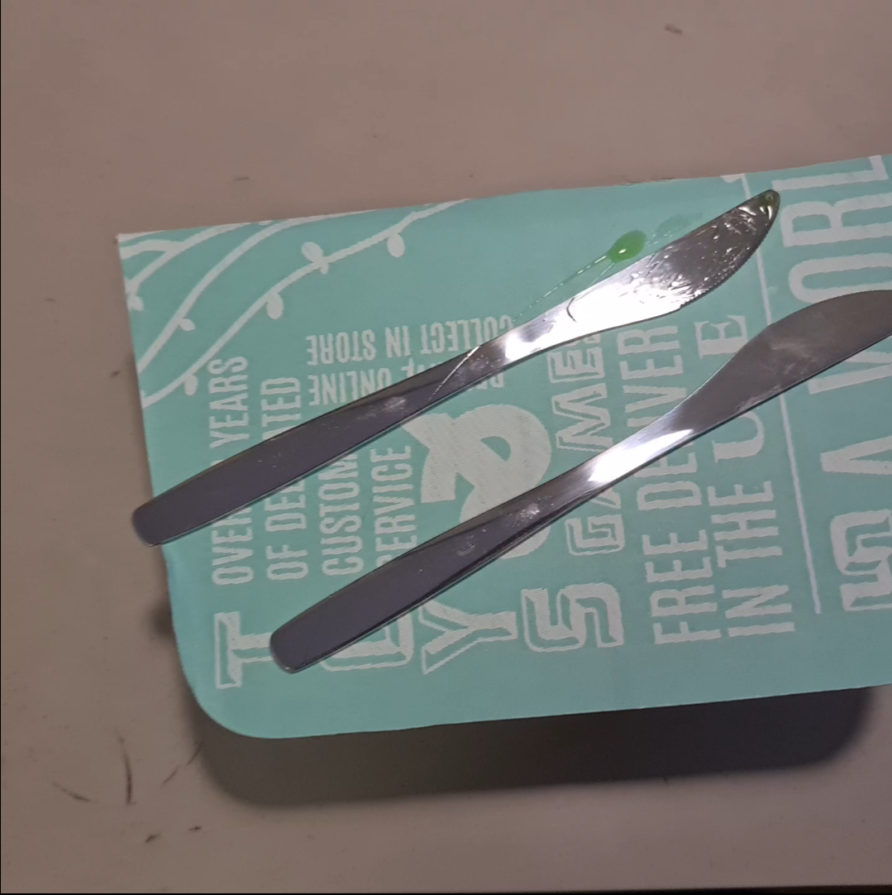
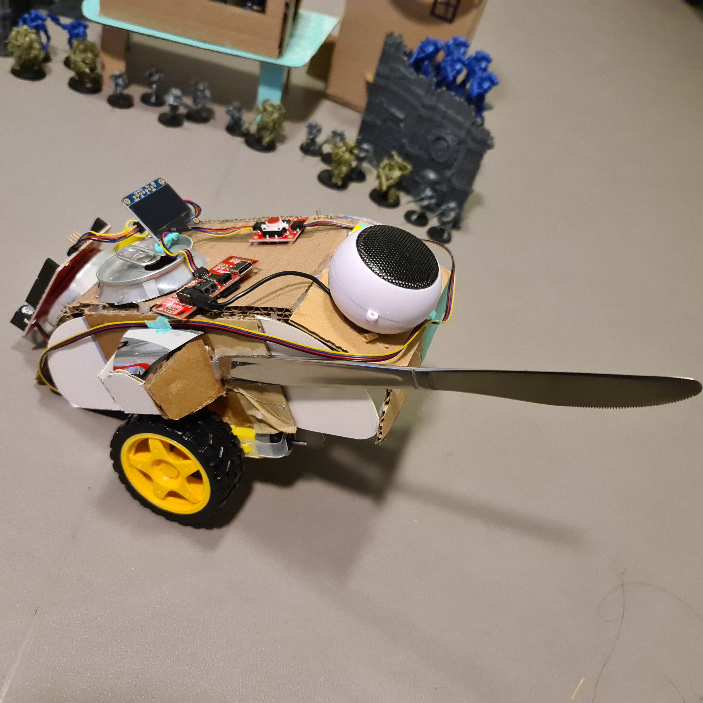
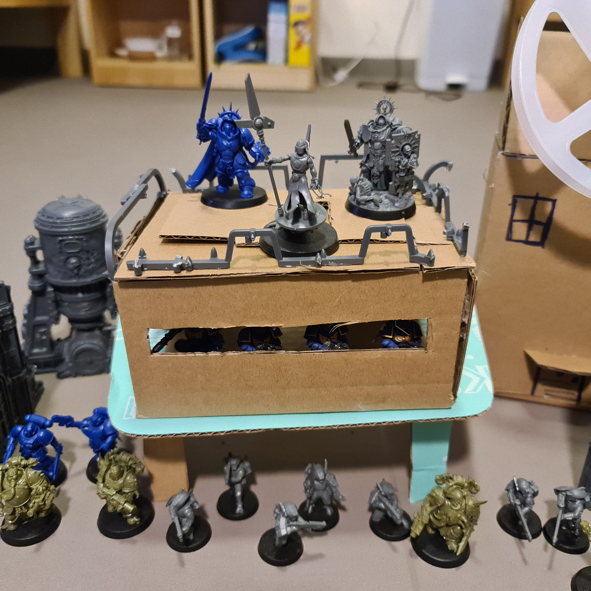
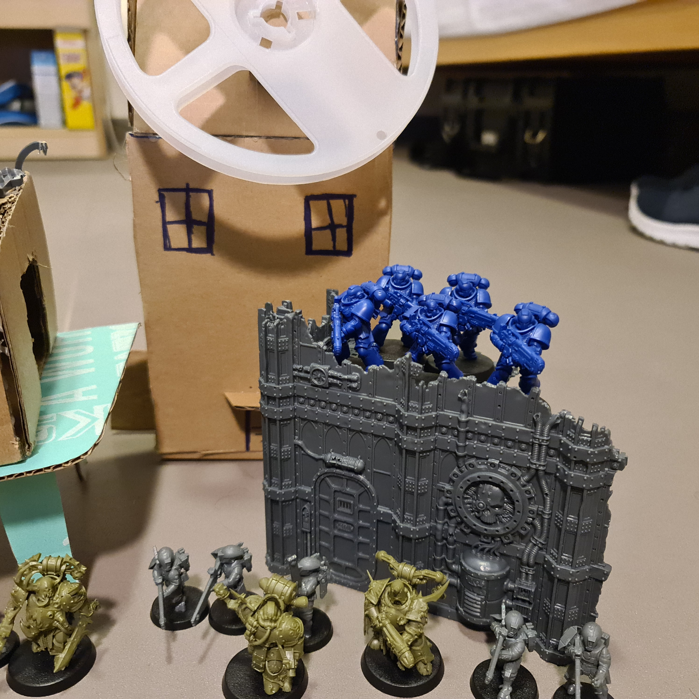
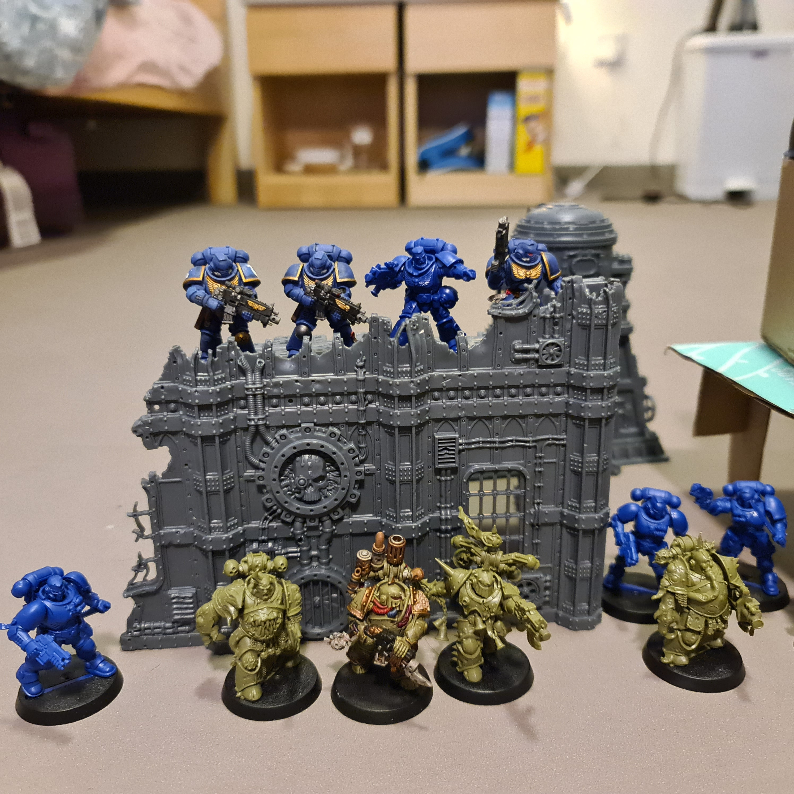

### Production Assignment: Actual Performing Robot

##### Play/Scene

Hamlet Fencing Scene.

The script follows hamlet being invted to a fencing match with laertes. the match would be in front of the king and queen. the fencing match was a excuse to kill hamlet using a poison sword and poisioned cup of vine. but things go south for the whole royal family as hamlet kills the king while the queen and hamlet die of poising

##### Experiments

lots of random and orderly movement mixed toghether

making props for background

using a video editing software for the first time

##### Props

I have a few model terrian props that I can use to populate the scene 

Make simple buildings and constructs using carboard

Use a circular object to make a windmill as background prop

Making a throne or stage for the king to be on

using knives as swords

making other actors using carboard
##### Photos

The prop used to display the swords for the play

former party tank returning to its destructive roots. equipped with a knife

stage for the king made out of cutout carboard box and knife prop. plastic figures from board game (Warhammer 40K)

windmill made out if cardboard and LED strip reel. plastic figures and plstic building from board game

same as other plstic models

##### Movements
the robot will spin 180 degrees and move back to its position.
the robot will then move forward. 
the robot will abruptly move and stop.
the robot will then shuffle
the robot will move right and left abruptly

#### Movie 

https://drive.google.com/file/d/1UjJ5ab45gEA_fOPtKofE3pCAZZgILYsL/view?usp=sharing

##### Problems

Robots can perform general movements not precise movements so many takes had to be taken to make each scene.

There is no good text to speech software or website that is free

I am bad at making good angels for recording.
